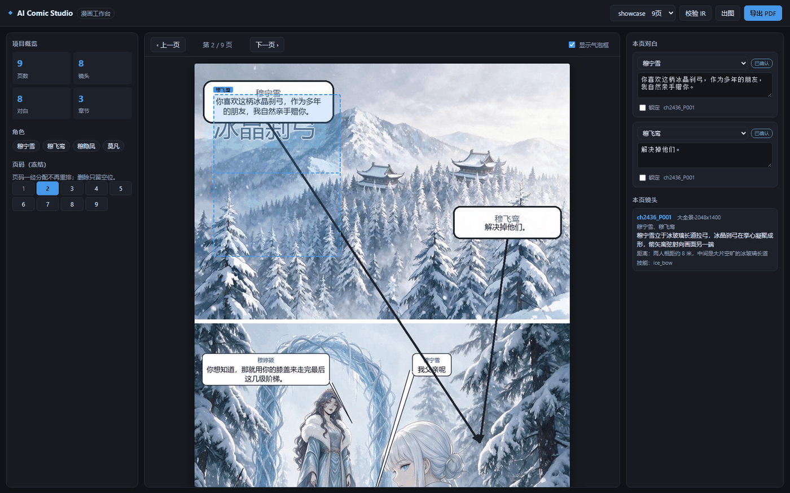
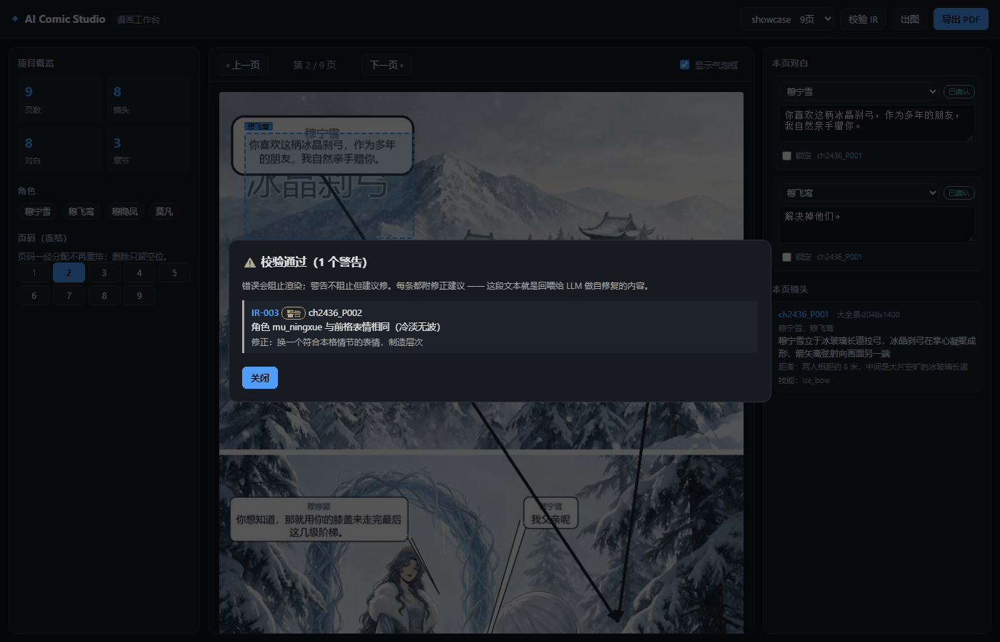
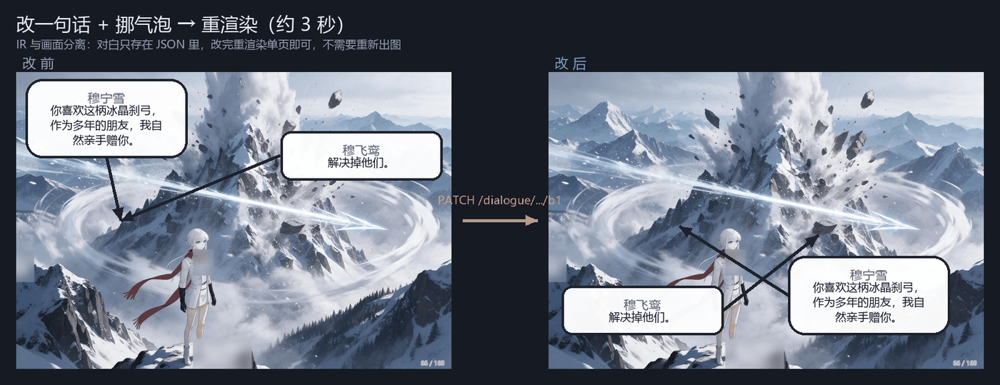

<div align="center">

# AI Comic Studio

**把小说自动改编成漫画的可复用开源方案**

定义受 Schema 约束的 **Comic IR**，让 LLM 只做创作决策、确定性引擎负责渲染
—— 用 **12 条业务规则 + 自修复循环** 解决 AI 生成漫画的
**一致性 / 可编辑性 / 可复现性** 三大难题

[]()
[]()
[]()
[](http://36.151.150.140/comic/)

</div>

---

## 效果演示

### 🌐 在线 Demo

**http://36.151.150.140/comic/**

（京东云 4 核 16 GB，Nginx 子路径 `/comic/` + systemd，生图用 mock 避免额度被刷）

### 工作台：可视化编辑 Comic IR



左侧项目概览与**只读页码**（冻结机制），中间画布叠加**可拖拽的气泡框**，
右侧对白编辑（说话人下拉 + 确认徽章 + 锁定开关）。

### 12 条规则校验：每条都附修正建议



这段文本就是**回喂给 LLM 做自修复**的内容 —— 错误结构化到「规则号 + 位置 + 修正方式」。

### 核心价值：改一句话，画面不变



对白只存在 JSON 里，改完**只重渲染那一页**（约 3 秒），
底图完全不动 —— 不需要重新出图。

---

## 问题：直接让 AI 画漫画，有三个必死问题

| 问题 | 现象 |
|---|---|
| **一致性崩溃** | 同一角色第 3 格换发色、第 8 格换衣服 |
| **不可控** | 想改一句台词，要重出整页图（90 秒/格） |
| **不可复现** | 同样输入两次，结果完全不同 |

---

## 解法：类比 Text-to-SQL，把「生成」拆成「决策」与「渲染」

- 不让 LLM 直接查数据库，而是让它产出 **SQL**（受 schema 约束的中间层）
- 不让 LLM 直接画漫画，而是让它产出 **Comic IR**（受 schema 约束的中间层）

```
小说文本 ──[AI 改漫 Agent]──▶ Comic IR ──[渲染引擎]──▶ 漫画 PDF
                                 ▲
                                 │
                        [可视化工作台] 人工微调
```

**收益**：

- ✅ **可校验** —— 12 条业务规则，渲染前就能发现 90% 的错误
- ✅ **可修复** —— 校验失败自动把结构化错误回喂给 LLM（Self-Repair）
- ✅ **可编辑** —— 改 IR 一句话 → 3 秒重渲染，不用重出图
- ✅ **可复现** —— 同 IR + 同素材 → 逐像素一致

---

## Comic IR：四个文件定义一本漫画

```
project/
├── bible.json       角色 / 场景 / 技能 / 风格（一致性的唯一来源）
├── storyboard.json  每格画什么
├── dialogue.json    谁说哪句、气泡放哪（★ 与画面分离）
└── layout.json      页序与分卷（★ 页码冻结，永不重排）
```

### 关键设计

| 设计 | 为什么 |
|---|---|
| **引用而非内联** | `cast` 只写 `character_id`，外观从 bible 取 → **不可能出现「这格换了衣服」**，因为根本没有第二个地方能定义外观 |
| **状态外置** | 角色伤情/服装在 bible 里跨格追踪 → 长程一致性有据可依 |
| **可追溯** | 对白带 `source_span` 指回原文行号 → 校验器能抓出 LLM 编造的台词 |
| **页码冻结** | 删除某格只标 `empty`，其余页码不动 → 协作时「第 78 页」永远指同一页 |
| **锁定机制** | 人工调过的气泡 `locked: true` → 自动布局不再覆盖 |

---

## 12 条业务规则（Validator）

JSON Schema 只能挡格式错误，挡不住「格式正确但语义错误」。
这 12 条规则专门针对 AI 改漫最容易犯的错：

| 规则 | 内容 | 为什么重要 |
|---|---|---|
| **IR-001** | 引用完整性：cast/skill/background 必须存在于 bible | 否则出图会换人 |
| **IR-002** | 两人以上同框必须写明具体距离 | 否则模型把两人画得像在聊天 |
| **IR-003** | 同一角色相邻两格不得同表情 | 否则全程一个表情 |
| **IR-004** | 主角损伤等级不得无故回落 | 否则伤口自愈 |
| **IR-005** | 伤情必须闭环（有起始镜头/愈合镜头） | 否则连续性断裂 |
| **IR-006** | 对白引用合法且说话人已确认 | 防止张冠李戴 |
| **IR-007** | 对白必须能在原文里逐字找到 | ★ **防 LLM 编造台词** |
| **IR-008** | 气泡与箭头坐标不得重合或越界 | 否则指向错误 |
| **IR-009** | 页序引用的镜头必须存在且不重复 | 防错位 |
| **IR-010** | 每个镜头都必须被排进页面 | 防漏排 |
| **IR-011** | 有对白的镜头说话人应在场（否则须声明画外音） | 防指向空气 |
| **IR-012** | 避免连续 ≥4 格同景别 | 防节奏呆板 |

```bash
python -m packages.cli rules      # 查看全部规则
```

---

## Self-Repair：让 Agent 错了能改

不指望 LLM 一次做对，而是：

```
生成 ──▶ 校验 ──失败──▶ 把「结构化错误 + 修正建议」回喂 ──▶ 重产
          │                                                      │
          └──────────────通过──────────────◀──────────────────────┘
                          │
                    仍失败 → 标记 pending_human（交人工，不硬渲染）
```

**实测输出**（`examples/minimal/run_full.py`）：

```
▶ 处理第 2436 章《冰晶刹弓》（191 字）
   [repair] 第 1 轮失败：1 个错误 ['IR-002']     ← 两人同框没写距离
   [repair] 第 2 轮通过
   章节状态：repaired（3 轮）
```

错误回喂的内容是**结构化、可操作**的：

```
- [IR-002] ch2436_P001: 有 2 个角色出场但未写 distance
  修正方式：写明具体距离，如「两人相距约 8 米，中间大片空旷冰道」；
            否则模型会把两人画得像在聊天
```

---

## 快速开始

### 端到端演示（完全离线，不需要任何 API key）

```bash
git clone <repo> && cd ai-comic-studio
pip install -e ".[dev]"

# 小说 → IR（含自修复）→ 校验 → 渲染 → PDF + 长图
python examples/minimal/run_full.py
```

### 可视化工作台

```bash
python scripts/make_demo_project.py    # 生成示例项目
python -m apps.api.server --port 8000
# 打开 http://127.0.0.1:8000
```

工作台可以：**拖拽气泡** → **改说话人** → **调箭头指向** → **一键重渲染** → **导出 PDF**

### Docker 一键部署

```bash
cp .env.example .env         # 按需填 key
docker compose up -d
# http://localhost:8000
```

镜像内置中文字体、预生成示例项目、带健康检查、数据持久化。
详见 [`docs/deploy.md`](docs/deploy.md)（含 Nginx / HTTPS / 子路径 / 公网成本控制）

### 部署到已有服务的服务器（子路径模式）

服务器 80 端口常被别的服务占用。本应用支持挂在子路径下：

```bash
# 服务端注入 <base href="/comic/">，前端相对路径与接口前缀自动算对
python -m apps.api.server --port 8500 --base-path /comic/
```

```nginx
location /comic/ {
    proxy_pass http://127.0.0.1:8500/;   # 结尾的 / 负责剥掉 /comic 前缀
}
```

一键部署（含字体安装、systemd、Nginx 追加配置、9 项远程验证）：

```bash
python scripts/deploy_remote.py
```

### 真实素材演示

```bash
# 用一份已有漫画 PDF 的画面当素材，演示效果更真实
python scripts/make_showcase_project.py --from-pdf path/to/comic.pdf
python -m apps.api.server --port 8000
# http://127.0.0.1:8000/?project=showcase&page=2
```

---

## 技术亮点

### ① 可插拔，不锁厂商

| 层 | 内置适配器 |
|---|---|
| **LLM** | OpenAI / DeepSeek / Moonshot / DashScope / Ollama / Mock |
| **生图** | Seedream / OpenAI Images / SD WebUI / 通用 HTTP / Mock |

所有外部服务都是适配器 + 工厂，**默认无厂商**。
本地模型（Ollama / SD WebUI）可直接跑；`Mock` 让测试与 Demo 完全离线。

### ② 气泡布局 = 内容能量最小化

```
能量 = 0.6 × 与画面中位色的差异 + 0.4 × 边缘梯度
```
气泡落在**画面最空、最不打扰人物**的位置。

配 `detect_person_side()`：肤色 + 深色发/衣 + 红色围巾，**排除雪白背景**
（雪景里不排除的话整幅都是「亮」的，判不出人物在哪）。

### ③ 三段式提示词 + 硬规则自动注入

```
① 共享风格块（全篇逐字相同）
② 角色标准块（从 bible 逐字取，绝不改写）
③ 本格构图（景别/位置/距离/动作/背景/氛围）
④ 禁止文字（★ 防止对白被画进图里）
```

按条件自动追加硬规则：极远景 / 双人距离 / 战斗形态 / 变身保脸型瞳色 / 损伤分级。

### ④ 渲染是纯函数

同 IR + 同素材 → **逐像素一致**（有测试保障）。
带来：可复现、可缓存、可 Golden 测试。

---

## 项目结构

```
ai-comic-studio/
├── packages/
│   ├── ir/                  ★ Comic IR 数据模型 + 12 条规则校验
│   ├── agent/               ★ AI 改漫 Agent
│   │   ├── providers.py         LLM 适配器
│   │   ├── prompts.py           提示词模板（规则前置 + 引用式）
│   │   ├── skills.py            5 个技能 + 自修复循环
│   │   └── pipeline.py          端到端编排
│   ├── render/              ★ 渲染引擎
│   │   ├── providers.py         生图适配器
│   │   ├── prompt.py            三段式提示词组装
│   │   ├── bubble.py            气泡布局算法
│   │   ├── page.py              页面合成
│   │   ├── export.py            PDF / 长图导出
│   │   └── studio.py            渲染编排
│   └── cli.py               命令行
├── apps/
│   ├── api/server.py        FastAPI 后端
│   └── workbench/           可视化工作台（纯静态，零构建）
├── tests/                   121 个测试
├── examples/minimal/        最小可运行示例
├── docs/
│   ├── design.md            完整方案与架构
│   ├── lessons.md           ★ 实战踩坑复盘（五个结构性坑）
│   ├── modifying.md         ★ 改动指南（常见改动怎么做 / 红线 / 验证流程）
│   ├── workbench.md         工作台说明
│   ├── deploy.md            部署指南（本地 / Docker / Nginx / 子路径）
│   ├── roadmap.md           路线图
│   └── images/              演示截图
├── scripts/
│   ├── e2e_check.py              ★ 端到端验收（25 项，一条命令）
│   ├── verify_online.py          ★ 线上自检（GitHub 仓库 + 服务器，28 项）
│   ├── deploy_remote.py          一键部署到服务器
│   ├── check_subpath.py          验证子路径部署模式
│   ├── make_demo_project.py      一键生成示例项目
│   ├── make_showcase_project.py  用真实素材生成展示项目
│   ├── make_graphics.py          生成 README 演示对比图
│   ├── shoot_ui.py               headless 截图（按文件大小确认加载完成）
│   └── smoke_api.py              API 冒烟测试
├── Dockerfile
└── docker-compose.yml
```

---

## 测试

```bash
pytest -q
# 129 passed
```

### 端到端验收（一条命令跑通全部流程）

```bash
python scripts/e2e_check.py
```

```
① 单元测试              129 passed
② 小说 → IR → PDF       生成 PDF 214 KB ｜ 自修复被触发 ｜ 长图 2 张
③ 生成示例项目          demo / showcase 四个 IR 文件齐全
④ 工作台 API（真实 HTTP） 10 个接口全部 200
⑤ 编辑闭环              PATCH 气泡 → 重渲染画面确实变化 ｜ 换说话人自动取消确认
⑥ 导出                  PDF 魔数 %PDF ｜ 长图 3 张
⑦ 前端静态检查          app.js 语法 OK ｜ README 图链完整

25/25 项通过
```

### 线上状态自检

```bash
python scripts/verify_online.py
```

```
① GitHub 仓库   公开 · 默认分支 main · 67 文件 · 提交已关联账号 · README 图 3/3 可访问
② 部署的服务器   11 个接口 200 · 页面图 33 KB · IR 校验通过

28/28 项通过
```

### 测试覆盖| 测试文件 | 数量 | 覆盖 |
|---|---|---|
| `test_validator.py` | 26 | 12 条规则各自的反例 + 正确样例必须通过 |
| `test_api.py` | 30 | 全部接口 + 编辑落盘 + 路径穿越防护 + **无改页码接口** |
| `test_render.py` | 23 | 提示词三段 / Mock provider / 合成 / 导出 / 逐像素可复现 |
| `test_agent.py` | 20 | JSON 提取 / 自修复编排 / 错误回喂验证 / 状态追踪 |
| `test_bubble.py` | 17 | 人物检测 / 避让 / 分侧 / 竖排不重叠 / 确定性 |
| `test_fonts.py` | 13 | **中文字体检测**（防「静默变方块」）/ 两条探测分支 / 缓存 / 警告 |
| `test_docs.py` | 12 | 文档示例代码的符号与真实代码一致 / 内部链接 / 红线完整性 |
| `test_subpath.py` | 9 | 子路径部署：`<base>` 注入 / 静态资源 / 接口前缀 / uvicorn 重导入坑 |
| `test_frontend.py` | 8 | JS 语法（node --check）/ HTML 挂载点 / 前后端路由对齐 / README 图链 |
| `test_pipeline.py` | 5 | 端到端编排 / 页码冻结 / pending 降级 |
| `test_packaging.py` | 3 | **依赖声明与实际 import 一致** / extras 覆盖 / 包发现 |
| | **166** | |

### 三个「只有上服务器才会暴露」的坑

这三个都是本地全绿、部署才炸，现在都有测试挡住：

| 坑 | 现象 | 根因 |
|---|---|---|
| **缺 numpy** | 服务启动即崩 | `pyproject.toml` 漏声明（本地早装好） |
| **缺中文字体** | 气泡中文全变方块，**接口仍返回 200** | 服务器只有 DejaVu，旧代码静默回落 `load_default()` |
| **字体探测失效** | 装了字体仍被判「不含中文」 | `mask.tobytes()` 在 **Pillow 12.3 被移除**，异常被吞 |

> 第二个最值得记：**静默降级比报错危险得多** —— 接口全绿、日志干净，
> 只有肉眼看图才发现全是方块。现在找不到中文字体会发 `RuntimeWarning`，
> 部署脚本也会单独验证这一项。

---

## 实战来源

本项目源于一次真实产出：**《全职法师》2426–2445 章改编，20 章 / 168 页 / 216 格**。

那次项目用散落脚本 + 人工校验完成，踩了五个结构性坑：

1. **对白烧进图片** → 改一句话要重出整页图
2. **页码中途变动** → 删一格导致全书错位，3 轮沟通无法对齐
3. **四层索引互相打架** → 任何一层不同步就出错图
4. **改动只在图里** → 项目一删，全部对白数据永久丢失
5. **没有阶段自检** → 出到第 100 格才发现前 30 格全错

**本项目的架构与 12 条规则，就是这五个坑的解法。**
详见 [`docs/lessons.md`](docs/lessons.md)

---

## 路线图

- [x] **Phase 1 · IR 层** —— 数据模型 + 12 条规则
- [x] **Phase 2 · Agent 层** —— Provider 抽象 + 提示词 + 5 技能 + 自修复
- [x] **Phase 3 · 渲染层** —— 生图适配 + 提示词组装 + 气泡算法 + PDF
- [x] **Phase 4 · 工作台** —— FastAPI + 可视化编辑
- [x] **Phase 5 · 部署** —— Docker + 线上 Demo（http://36.151.150.140/comic/）
- [ ] 更多：真实生图案例 / 在线试玩 / 条漫模式 / 版本 diff

详见 [`docs/roadmap.md`](docs/roadmap.md)

**想改这个项目？** 先看 [`docs/modifying.md`](docs/modifying.md) ——
常见改动怎么做、五条不能破的红线、改完如何验证与部署。

---

## License

MIT
