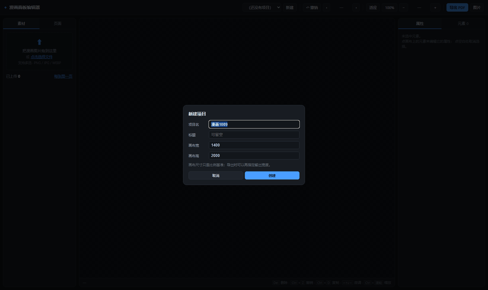
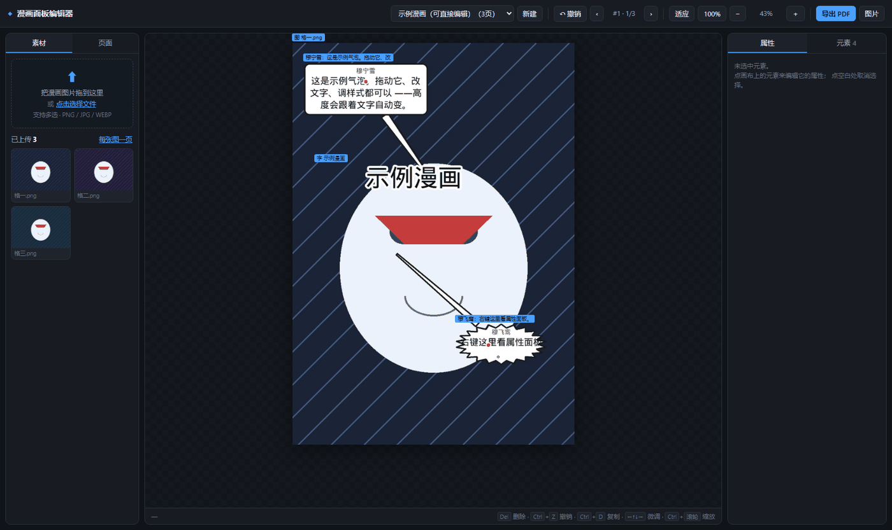

# 面板编辑器

> 从**空白画布**手工做漫画 —— Office 式的编辑体验。
> 上传漫画图片、拖到页面、加气泡、调顺序、导出 PDF。

线上：**http://36.151.150.140/comic/**（默认打开的就是这个编辑器）

**打开是空的，从 0 开始** —— 点「新建」建一个项目，然后上传你的漫画图片。
需要演示用的示例项目时，手动跑一次：

`ash
python scripts/seed_demo_project.py            # 生成「示例漫画」项目
python scripts/seed_demo_project.py --force    # 覆盖重建
`

打开时的样子（空白起点）：



上传图片、加气泡后的效果：



---

## 和「小说自动改编」的关系

这个项目里有**两套独立的东西**，互不依赖：

| | 面板编辑器（本页） | 小说自动改编 |
|---|---|---|
| 入口 | `/`（默认首页） | `/workbench` |
| 做什么 | 从空白页手工拼漫画 | 把小说文本自动改成漫画 |
| 数据 | `works/<项目>/project.json` | `projects/<项目>/*.json` |
| 代码 | `packages/editor/` + `apps/api/editor.py` | `packages/ir/` + `packages/agent/` |
| 接口 | `/api/edit/*` | `/api/*` |

两者**不共享模型、不共享接口**，可以各自演进。
唯一共用的底层是 `packages/render/`（字体、气泡避让算法、PDF 导出）。

---

## 界面

```
┌──────────────────────────────────────────────────────────────────────┐
│ ◆ 漫画面板编辑器   [项目▼][新建] │[撤销]‹ #1·1/3 ›│[适应][100%][−][+][导出PDF][图片]│
├──────────┬──────────────────────────────────────┬────────────────────┤
│ 素材│页面 │                                      │ 属性│元素 4        │
│          │                                      │                    │
│ ┌──────┐ │      ┌────────────────────┐          │ 未选中元素。        │
│ │ 拖到这里│ │      │  ┌─────────┐        │          │ 点画布上的元素来编辑  │
│ │ 或点击  │ │      │  │气泡 穆宁雪│──┐     │          │ 它的属性；          │
│ └──────┘ │      │  └─────────┘  │     │          │ 点空白处取消选择。    │
│          │      │        ┌──────▼───┐  │          │                    │
│ 已上传 3  │      │        │气泡 穆飞鸾│  │          │                    │
│ ┌──┬──┐ │      │        └──────────┘  │          │                    │
│ │图│图│ │      └────────────────────┘          │                    │
│ ├──┼──┤ │       虚线框 = 可拖动                   │                    │
│ │图│  │ │       ● 圆点 = 箭头可拖                   │                    │
│ └──┴──┘ │                                      │                    │
├──────────┴──────────────────────────────────────┴────────────────────┤
│ —                          Del 删除 · Ctrl+Z 撤销 · Ctrl+D 复制 · ←↑↓→ 微调 │
└──────────────────────────────────────────────────────────────────────┘
```

---

## 能做什么

### ① 上传图片

- 拖进左侧虚线框，或点「点击选择文件」
- **支持多选**；PNG / JPG / WEBP / BMP / GIF
- 也可以直接把图片拖进画布区域
- 点素材卡片 → 加到当前页；**拖素材卡片到画布上** → 落在鼠标位置
- 「每张图一页」：一键给每张素材各建一页并铺满（批量导入最常用）

### ② 加气泡

- 工具栏/空状态里的「加气泡」按钮
- **自动避开人物**：复用 `packages/render/bubble.py` 的内容能量最小化算法
- 五种样式：

| 样式 | 外观 | 用途 |
|---|---|---|
| `对话` | 圆角矩形 + 指向尾巴 | 普通对白 |
| `喊叫` | 爆炸锯齿形 | 大喊 |
| `心声` | 云朵 + 一串圆点 | 心里想的 |
| `旁白` | 方框 | 旁白 / 画外音 |
| `低语` | 圆角框 + 虚线 | 小声说 |

- **高度自动**：改字号或文字，气泡自己长高（像 Office 文本框），不会文字溢出
- **箭头可拖**：拖动橙色小圆点改指向；也可以直接调 X/Y

### ③ 编辑大小与位置

- 拖动元素移动；拖**角上的手柄**缩放
- 气泡只横向缩放（高度自动），图片等比缩放（不变形）
- 属性面板里可以精确输入 X / Y / 宽 / 高（百分比）
- 方向键微调（`Shift` 加速）

#### 对齐吸附

拖动时如果元素的中线/边缘靠近**画布中线**或**其他元素的边**，
会自动吸上去，并画出一条**洋红色参考线**告诉你对齐到了哪。

```
         │ ← 画布纵向中线（吸附时会亮起来）
   ┌─────┼─────┐
   │  气泡      │
   └─────┼─────┘
```

吸附阈值是画布尺寸的 0.8% —— 太小吸不住，太大又会「粘手」。

#### 多选

| 操作 | 效果 |
|---|---|
| `Shift` + 点元素 | 加选 / 减选 |
| 空白处按住拖动 | **框选**（橡皮筋） |
| `Ctrl` + `A` | 全选本页 |
| 拖动任一选中元素 | **整组一起移动**（走一次 `batch-move` 请求） |
| `Del` | 批量删除（会先确认） |
| `Esc` | 取消选择 |

> 多选移动是**一条请求**提交的，不是 N 条 ——
> 这样在乐观并发控制下只占用一个 `revision`，
> 不会出现「移动了 4 个元素、其中 2 个因为版本冲突没生效」。

### ④ 页面模板（分格）

新建的页面是一张白纸，逐个摆图很累。左侧「页面」标签页里有
**8 种分格模板**：满版 / 上下 2 格 / 左右 2 格 / 2×2 四格 /
上一下二 / 上二下一 / 横条 3 格 / 2×3 六格。

一键套用后，页面上出现对应数量的**浅灰占位格**（格间留 0.008 的白边），
你只要往格子里放图。

两个可选项：
- **按顺序填入素材**：已有的素材自动铺进格子（`fit=cover`），不够的格子留占位
- **先清空这一页**：套用前删掉当前页已有元素（会先 `confirm`）

> ★ 没素材时用的是 `kind="shape"` 而不是 `kind="image"` ——
> 后端的 `add_element` 对 image 强制要求有效 `asset_id`，
> 没素材会直接 400，而「新建空白页 → 套模板」正是最需要模板的场景。
>
> 套用后分格会被排到**最下层**（`elements/order`），否则会盖住你已有的气泡。

### ⑤ 图片裁剪

选中图片 → 属性面板「✂ 裁剪」→ 画布上出现四条边可拖的保留框
（框外压暗）→ 底部工具条「重置 / 完成 / 取消」。

> ★ 这里的坑最深，值得说清楚：
> `crop = [l, t, r, b]` 是**四边相对原图的内缩比例**，不是包围盒；
> 而且渲染顺序是**先裁、后 fit**（cover/contain），
> 所以「框在元素盒子里的比例」**不等于** crop。
> 直接把框的比例当 crop 写进去，实测偏 15.6% 原图宽
> —— 相当于可见宽度的一半，「所见非所切」。
>
> 正确做法是按渲染器的同一套 fit 数学**反解**（`viewMap`）：
> 框住哪块，写进去就是哪块。
>
> 另外：裁剪**不会让元素盒子变小**（高度仍按原图宽高比算），
> 保留的部分会被放大铺满原来的框 —— 这是刻意的，工具条里有提示。

### ⑥ 调顺序

**两种顺序都能调**：

| 调什么 | 在哪调 | 说明 |
|---|---|---|
| **元素叠放顺序** | 右侧「元素」面板的 ↑↓ | 上层会盖住下层 |
| **页面顺序** | 左侧「页面」面板的 ↑↓ | ★ **页码不变** |

> **页码是身份，不是位置。** 把第 1 页移到第 3 位，它的页码仍然是 `#1` ——
> 这样「第 7 页」永远指同一页。删掉的页码也不会被回收。
> 这个约定来自一次真实事故：删掉一页导致全书页码错位，沟通彻底对不上。

### ⑦ 其他元素

- **文字**：标题、拟声词。支持描边（外发光）、旋转、行距
- **色块**：矩形 / 椭圆，用来**压住原图上的文字**或做分格线

### ⑧ 撤销

每次修改前自动存快照，`Ctrl+Z` 或点「撤销」。
空的状态会提示「没有可撤销的操作」。

> 快照**落在磁盘上**（`<项目>/.history/`，环形保留 40 份），
> 所以**重启服务也不会丢**。原来只存内存，`systemctl restart` 一次就全没了。
>
> ⚠️ 已知限制：套一次分格模板会产生 N+1 个撤销步（每格一步 + 排序一步），
> 因为后端每个写接口各自压一次快照，前端无法合并 —— 要按 N+1 次撤销才能回退。

### ⑨ 导出

| 格式 | 说明 |
|---|---|
| **PDF** | 每页一张，适合成书 |
| **图片** | ZIP 打包逐页 PNG |
| **长图** | 竖着拼成一张 |

导出宽度可指定（默认 1240px）。

---

## 快捷键

| 按键 | 作用 |
|---|---|
| `Del` / `Backspace` | 删除选中元素（多选时批量删） |
| `Ctrl+Z` | 撤销 |
| `Ctrl+D` | 复制选中元素 |
| `Ctrl+A` | 全选本页元素 |
| `Shift` + 点元素 | 加选 / 减选 |
| 空白处拖动 | 框选 |
| `← ↑ ↓ →` | 微调位置（`Shift` 加速 5 倍） |
| `Esc` | 取消选择 |
| `PageUp` / `PageDown` | 上一页 / 下一页 |
| `Ctrl + 滚轮` | 缩放画布 |

---

## 设计要点

### 服务端渲染，前端只发坐标

```javascript
// 前端：拖完只发一个坐标
await api(`/api/edit/projects/${name}/elements/${id}`, {
  method: 'PATCH', body: JSON.stringify({ props: { x, y } })
});
await drawCanvas();     // 重新拉一张服务端渲染好的图
```

**为什么**：否则前端一套排版、导出时后端又是一套，迟早对不上。
现在保证 **编辑器所见 = 导出所得**。

### 服务端返回包围盒

气泡高度由文字决定。如果前端自己算高度，就会和服务端渲染出来的不一致 ——
选择框会比气泡大一圈或小一圈。

做法：渲染接口把每个元素的包围盒放进响应头

```http
GET /api/edit/projects/demo/pages/<id>/render.png?w=1240&boxes=1
→ X-Element-Boxes: <base64 JSON>   # {element_id: [x, y, w, h]}
```

前端直接拿它画选择框，**前后端不会各算一套**。

### 坐标用归一化比例

所有位置尺寸都是 0–1 的比例（相对画布宽/高），不是像素。
换分辨率、导出不同尺寸时不用重算，前端直接乘显示尺寸。

---

## 踩过的坑（都有测试锁住）

| 坑 | 现象 | 根因 |
|---|---|---|
| **箭头变成巨大白三角** | 箭头拖远时一个白色多边形糊掉整页 | 尾巴基点用「圆心 + 半径×方向」近似，方向接近水平/垂直时基点被推到画面外。改为求**边界交点** |
| **箭头又长又细像根针** | 小气泡拖出长刺 | 长度上限按「气泡尺寸」算。改为按**画布尺寸**（短边 38%）+ 尖端保留 25% 宽度 |
| **图片选择框比图高一大截** | 点不到实际图片 | 包围盒高度把「像素宽」当成了「比例高」 |
| **删除素材后选框还在** | 画面上有个点不到的空框 | 素材取不到时仍记进了包围盒。改为**取不到就跳过** |
| **CSS/JS 404 导致白屏** | 页面 200 但布局塌、画布空白 | `editor.html` 引的是 `editor.css`，而文件在 `static/` 下 → 请求落到 `/editor.css` |
| **删页后页码被回收** | 「第 2 页」一会儿指这页一会儿指那页 | `next_number` 用 `max(现有页码)+1`。改为单调递增的 `max_number` |

> 前五个接口全都返回 200 —— **只有肉眼看图或量几何才发现**。
> 所以 `tests/test_editor.py` 里有 88 个测试，其中相当一部分是渲染像素与几何的断言。

---

## 数据在哪

```
works/<项目名>/
├── project.json     页面与元素（所有编辑都在这里）
├── assets/          上传的原图（不改动，保留原始文件）
└── out/             导出产物（PDF / ZIP / 长图）
```

**所有编辑只写 `project.json`，不碰原图。**
原图随时可以重新渲染，反过来不行 —— 这是从「改动烧进图里、删目录后数据全丢」的教训来的。

---

## 目录

```
packages/editor/
├── models.py    项目 / 页面 / 元素 / 素材模型
├── render.py    服务端渲染（含箭头几何、气泡高度、图片包围盒）
└── store.py     磁盘读写（原子写、每项目写锁、撤销快照、防路径穿越）

apps/api/editor.py        26 个接口 + 渲染缓存（LRU + 内容指纹）
apps/workbench/
├── editor.html           布局（三栏 + 工具栏）
├── editor.css            样式（Office 风）
└── editor.js             交互（拖拽 / 缩放 / 多选 / 吸附 / 裁剪 / 模板 / 撤销）

tests/test_editor.py            模型 / 渲染几何 / 接口 / 静态资源
tests/test_editor_robust.py     并发 / 版本冲突 / 撤销持久化 / 上传 / EXIF / 包围盒像素
tests/test_editor_frontend.py   在 node 里跑 editor.js 的真实函数（吸附、多选、模板几何）
tests/test_editor_smoke.py      在 node 里真跑一遍 editor.js 顶层（抓 TDZ 那类静默失效）
```

---

## 性能

| 操作 | 改前 | 改后 |
|---|---|---|
| 渲染一页（`render.png`） | 732 ms | **11 ms**（缓存命中，−98.5%） |
| 元素几何（`elements-geometry`） | 736 ms | **1.6 ms** |
| 导出（3 页） | 393 ms | 186 ms |

渲染缓存 key = `(工作区, 项目名, 页面id, 宽度, sha256(revision + 页面 + 素材)[:20])`。
三个刻意的选择：

- 用 `hashlib` 不用 `hash()` —— `PYTHONHASHSEED` 每进程不同，多 worker 会各算各的
- 宽度按渲染器同一套 `max(64, w)` 钳制，否则 `w=10` 和 `w=64` 会各存一份相同的图
- 指纹含 `revision`：多进程下别的进程改了项目，本进程的内存缓存通知不到，
  只能靠重新读到的 `revision` 发现

响应头带 `X-Cache: hit|miss`。这是刻意的 —— 这个项目已经两次栽在
「静默降级」上（缺字体渲染出方块、缺依赖服务起不来但 systemd 显示 active），
缓存必须有可验证的痕迹。

---

## 后续想加的功能

- [x] ~~多选元素（框选 / Shift 点选）~~ —— 已完成
- [x] ~~对齐辅助线（拖动时吸附到中线与其他元素）~~ —— 已完成
- [x] ~~图片裁剪工具~~ —— 已完成
- [x] ~~页面模板（2×2 分格、上下分格等）~~ —— 已完成
- [ ] **把一次套模板合并成一个撤销步**（现在 N+1 步；需要后端批量接口）
- [ ] 撤销/重做栈在浏览器本地也存一份（现在落盘在服务端，但多标签页不共享）
- [ ] 复制粘贴元素（跨页粘贴）
- [ ] 元素分组（多个元素成组一起移动）
- [ ] 图片裁剪的「保持比例」模式（现在裁完会放大铺满原框）
- [ ] 前端加真实点击的端到端测试（现在只有 node 冒烟 + 接口测试）
